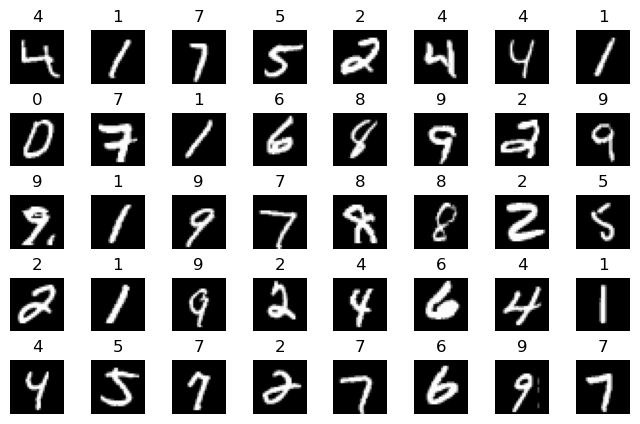
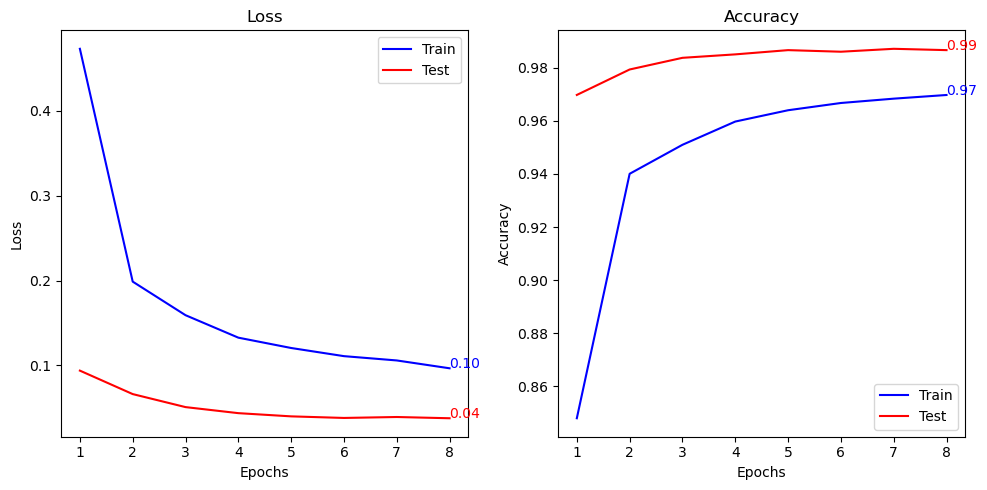
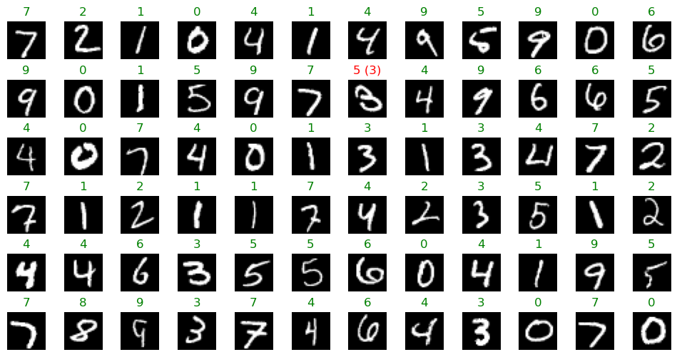

# MNIST

Ce projet est inspiré d'un [TP Fidle](https://fidle.cnrs.fr/w3/). Il s'agit de classer des images de chiffres manuscrits en utilisant un réseau de neurones convolutionnel.

## Données

Les données utilisées sont celles du MNIST. Elles sont disponibles dans le package `torchvision` de PyTorch.

## Modèle

Le modèle utilisé est un réseau de neurones convolutionnel. Il est composé d'un couche de convolution suivie d'une couche de pooling, puis d'une seconde couche de convolution suivie d'une seconde couche de pooling. Enfin, les sorties sont aplaties et passées dans une couche linéaire.

## Résultats

Le modèle atteint une précision de 99% sur l'ensemble de test après un entraînement de 8 époques.

